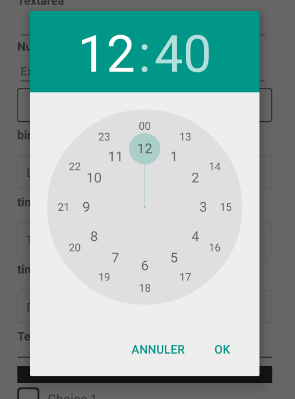
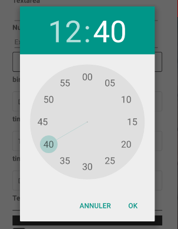
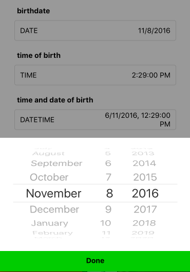
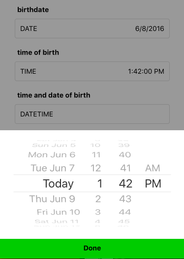

# react-native-osd-datetimepicker
A DateTime Picker for Android and iOs for react-native

For react-native v0.26+

# How it looks

### Closed

 

### Open

Android

  

iOs

  

# Output

For `time` : `HH:MM:00`

For `date` : Local date string (parsable in `new Date()`)

For `datetime` : Local datetime string (parsable in `new Date()`)

# Properties

Property Name | Type | Remark
--- | --- | ---
date | React.PropTypes.string
mode | React.PropTypes.oneOf([ 'datetime', 'date', 'time' ]) |
onChange | React.PropTypes.func.isRequired
iosDoneButtonText | React.PropTypes.string
iosDoneButtonStyle | Button.propTypes.containerStyle | see [react-native-osd-simple-button](http://github.com/osedea/react-native-osd-simple-button)
iosClosePickerButtonTextContainerStyle | Button.propTypes.textContainerStyle | see [react-native-osd-simple-button](http://github.com/osedea/react-native-osd-simple-button)
iosClosePickerButtonTextStyle | Button.propTypes.textStyle | see [react-native-osd-simple-button](http://github.com/osedea/react-native-osd-simple-button)
renderAndroidButton | React.PropTypes.func
